<!-- logo -->

## 🌍 MINT
### 🎉 프로젝트 소개
```MINT```는 **NFT**와 **블록체인** 을 이용해서   
광활한 우주에서의 내 땅을 사고 팔고 관리하는 프로젝트 입니다.  
* [MINT HOMEPAGE](http://j6a106.p.ssafy.io/)
* [MINT NOTION](https://hill-pedestrian-45d.notion.site/NFT-bc47c3363d0248eab13852835c91694c)
* [시연영상](https://youtu.be/4IZwXgH34B4)

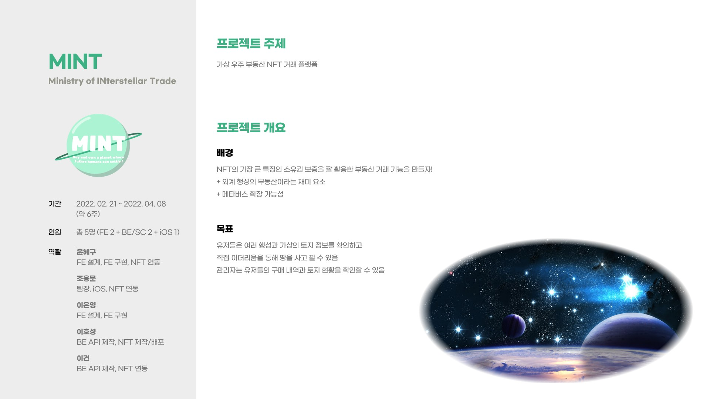
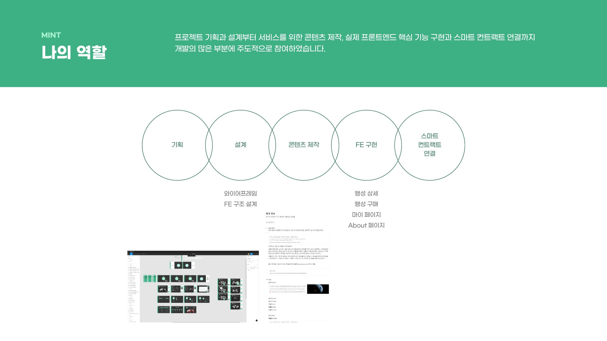
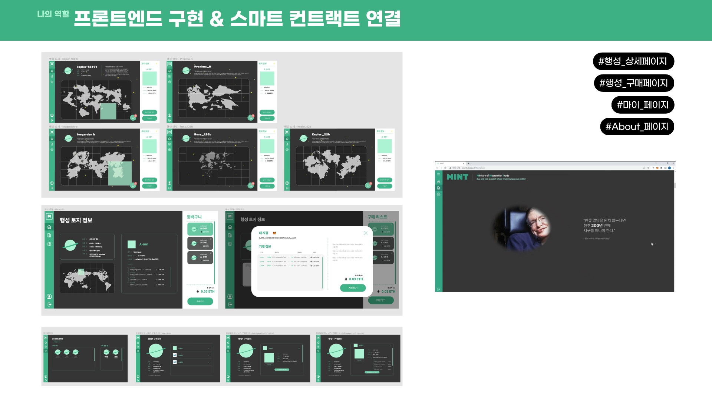
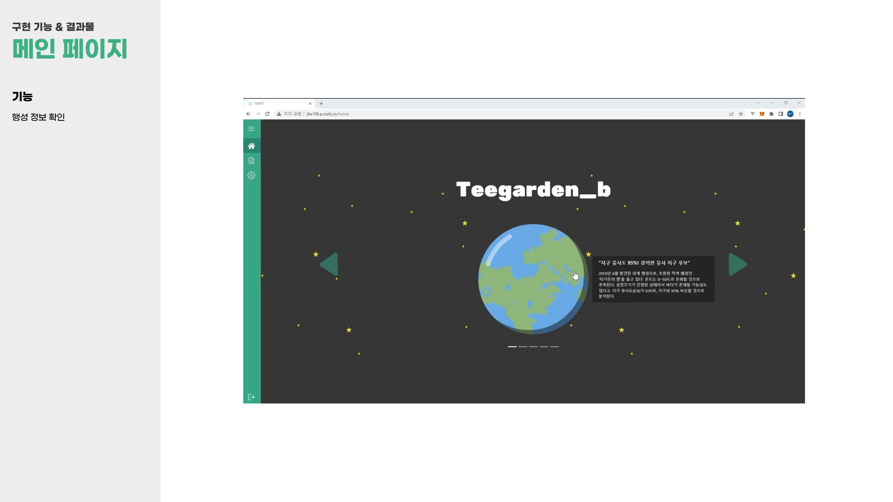
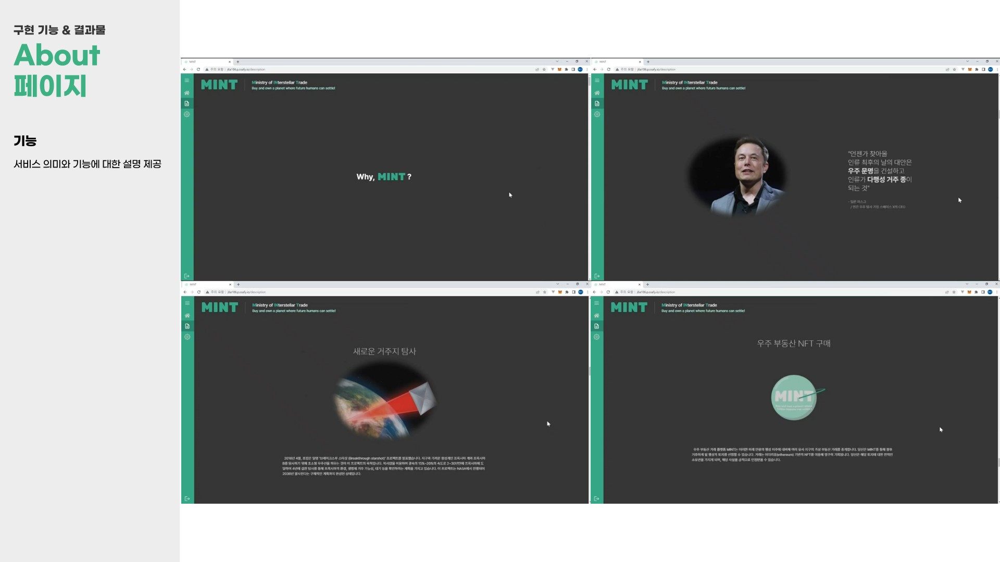
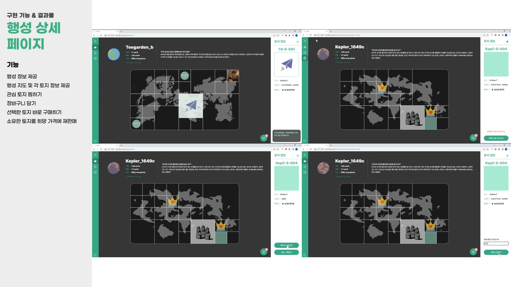

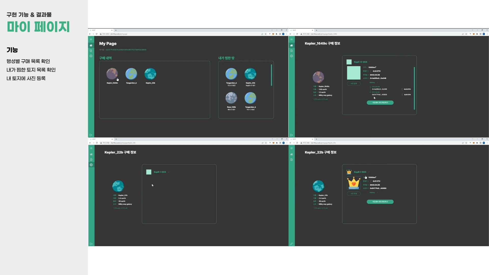
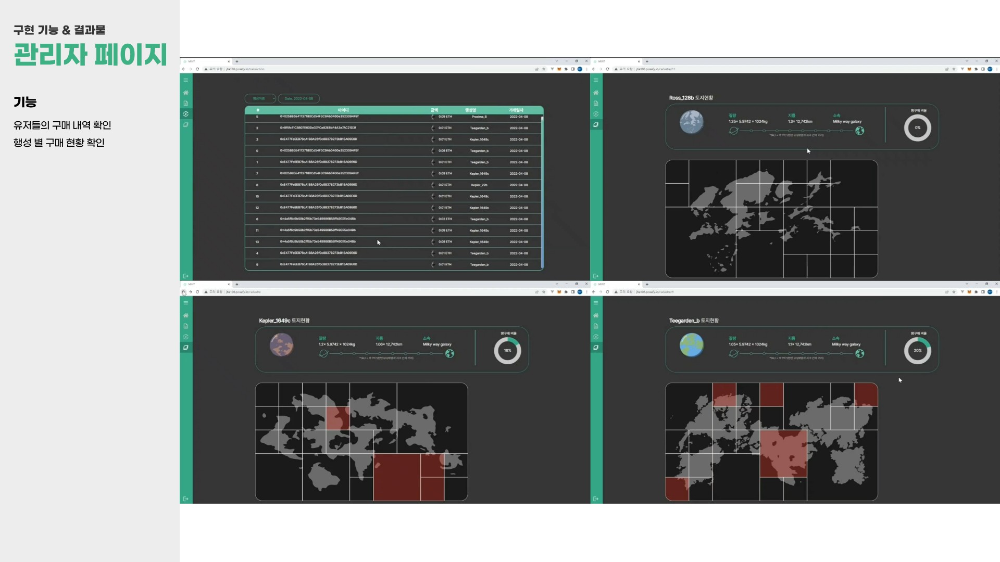
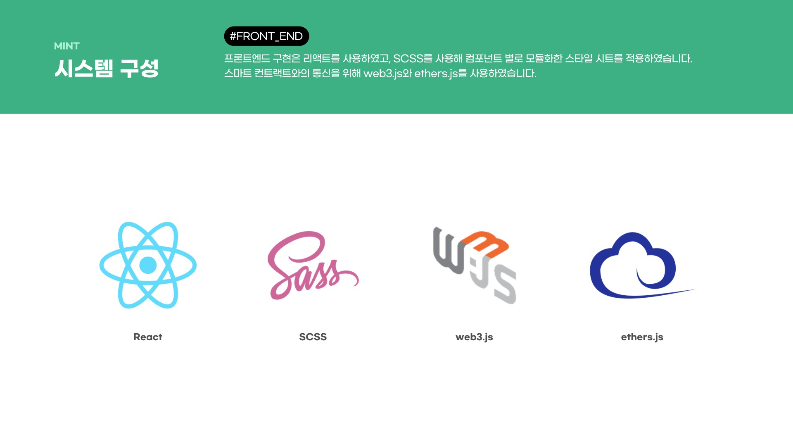
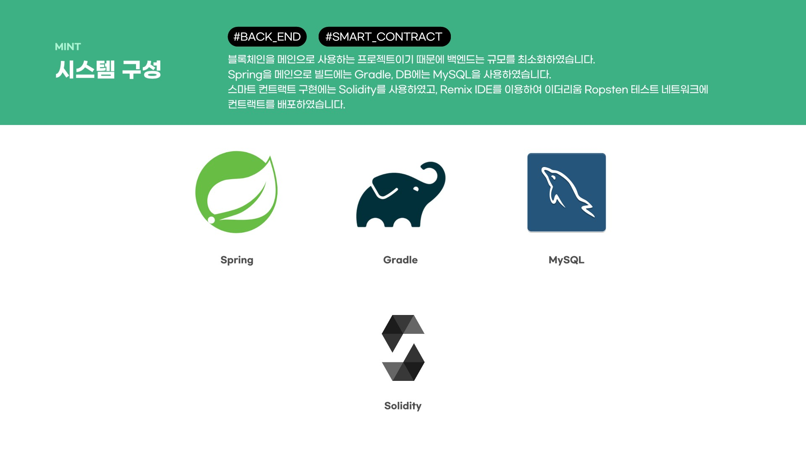
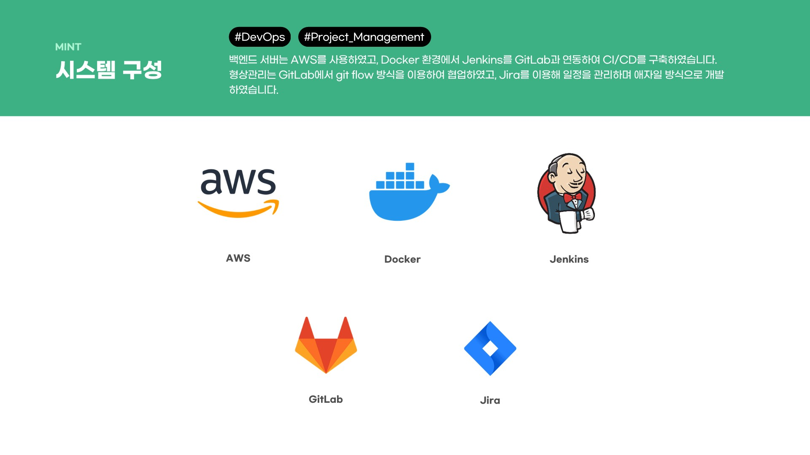
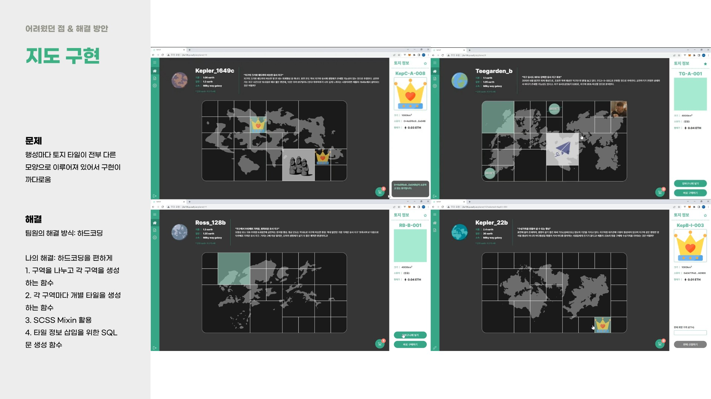


### 💡 기술 스택
#### FrontEnd

 


#### BackEnd


### DevOps


### Co-tool


### 시스템 구성도
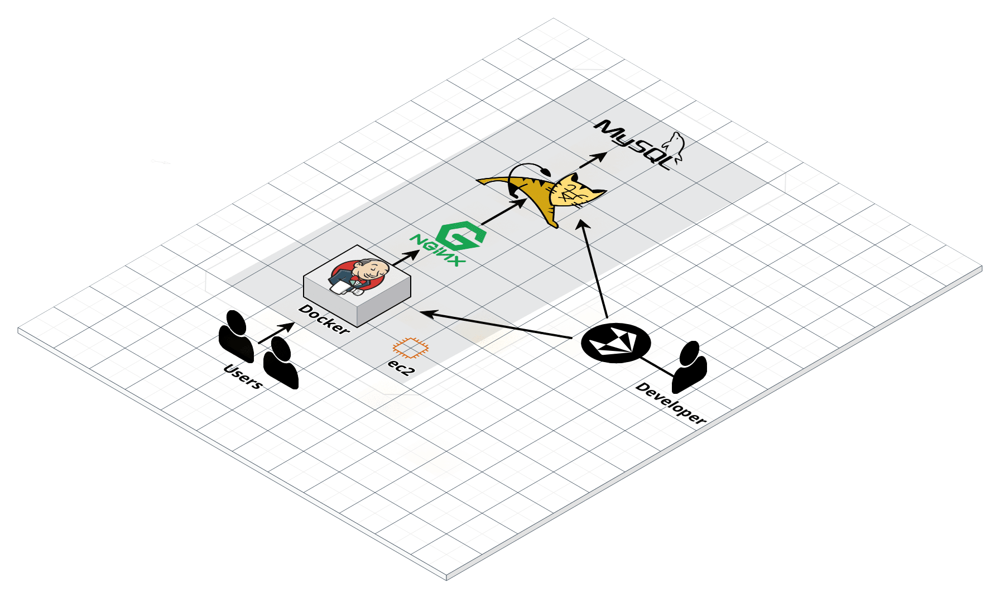

### 📌 주요 기능
* **홈 화면**
  - ```행성 정보 제공 및 상세화면 연동``` <br>

  - ```사이드 바 및 지갑 연결```<br>
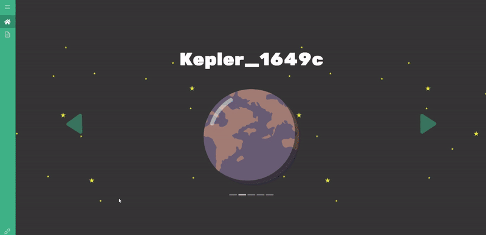
  <br>

* **상세 화면**
  - ```행성 지도를 확인 할 수 있으며 타일 선택을 통해 구매 가능```<br>
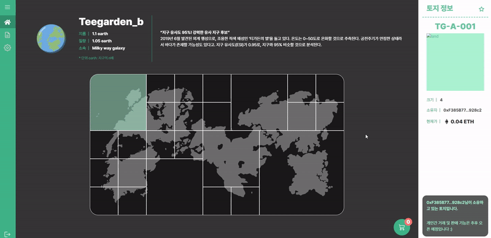
  <br>

  - ```장바구니 버튼을 통한 행성 담기 기능```<br>
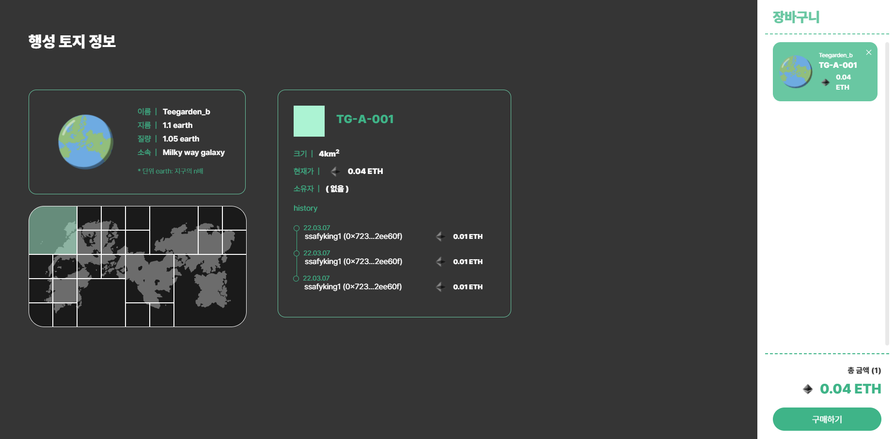
<br>

* **관리자 페이지** <br>

  - ```거래 내역 확인 및 행성 별 토지 현황 확인```<br>
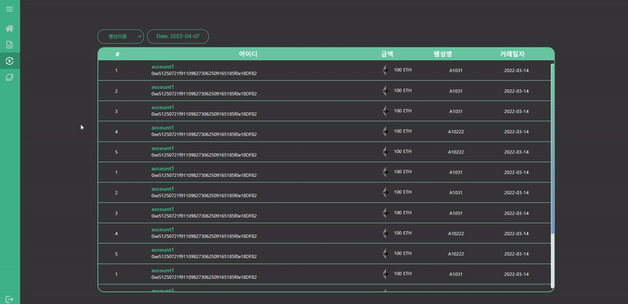
<br>
  
* **프로젝트 설명 페이지**

  - ```프로젝트의 전반적인 설명```<br>
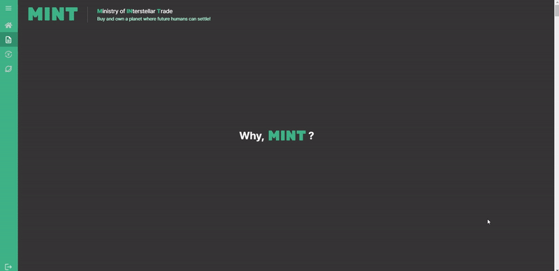
<br>

### 🧑 팀원 소개
<details><summary><strong>조용문</strong> [ FE ]&nbsp;&nbsp;&nbsp;<em>Click!</em></summary>

 * **팀장**
 * iOS App의 모든 것을 담당
 * NFT 연동
</details>
<details><summary><strong>이은영</strong> [ FE ]</summary>

  * FE 설계
  * FE 구현
  * 팀 JIRA 총괄 담당
</details>
<details><summary><strong>윤혜구</strong> [ FE ]</summary>

  * FE 설계
  * FE 구현
  * NFT 연동
</details>
<details><summary><strong>이호성</strong> [ BE ]</summary>

  * 스마트 컨트랙트 제작 및 배포
  * Favorite API, Planet API 제작
</details>
<details><summary><strong>이건</strong> [ BE ]</summary>

  * 스마트 컨트랙트 연동
  * Tile API 제작
</details>

### :penguin: 빌드 및 배포
* [보러가기✔](https://github.com/une9/MINT/blob/0064bd7ff4fb8bbbce0e8326e64cc84113c16e1a/exec/%EB%B9%8C%EB%93%9C%20%EB%B0%8F%20%EB%B0%B0%ED%8F%AC.md)

### :triangular_flag_on_post: 버전 정보
* [보러가기✔](https://github.com/une9/MINT/blob/0064bd7ff4fb8bbbce0e8326e64cc84113c16e1a/exec/%EB%B2%84%EC%A0%84%EC%A0%95%EB%B3%B4.md)

### :beginner: DB 정보
* [보러가기✔](https://github.com/une9/MINT/blob/0064bd7ff4fb8bbbce0e8326e64cc84113c16e1a/exec/DB_%EC%A0%95%EB%B3%B4.md)

### :ticket: 외부 서비스
* [보러가기✔](https://github.com/une9/MINT/blob/0064bd7ff4fb8bbbce0e8326e64cc84113c16e1a/exec/%EC%99%B8%EB%B6%80%20%EC%84%9C%EB%B9%84%EC%8A%A4.md)
